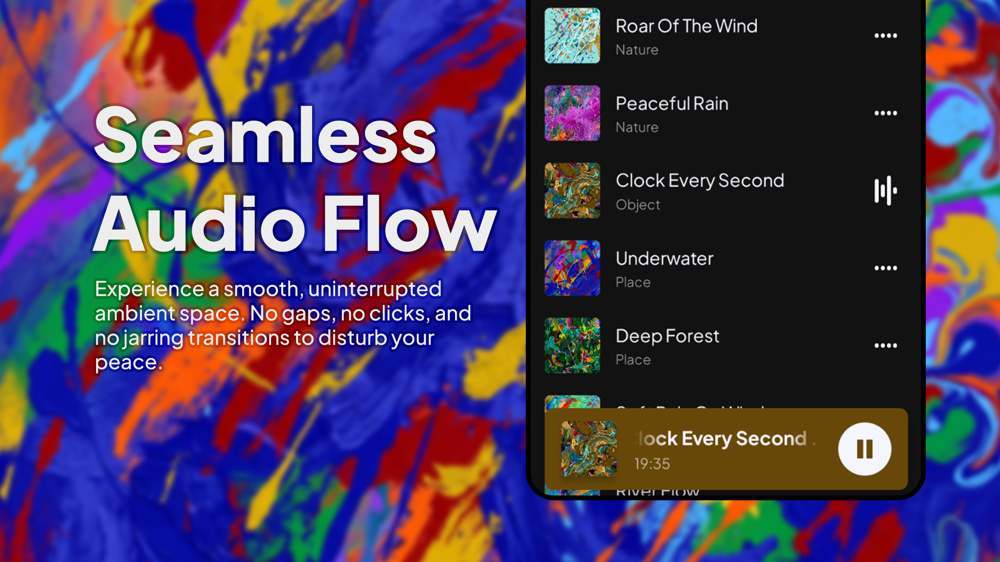
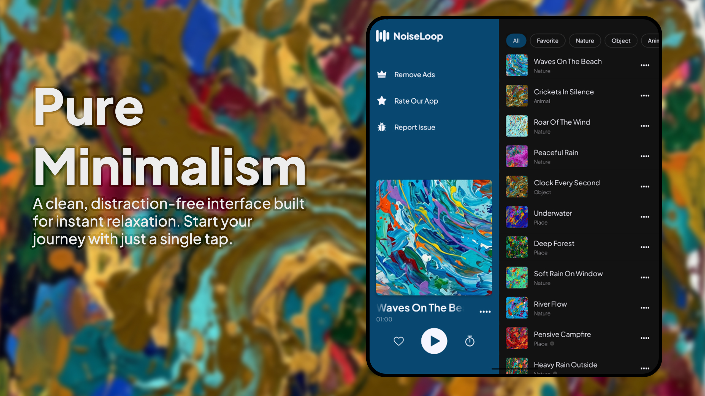
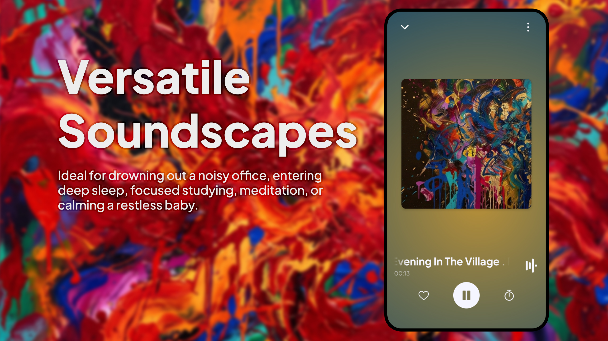
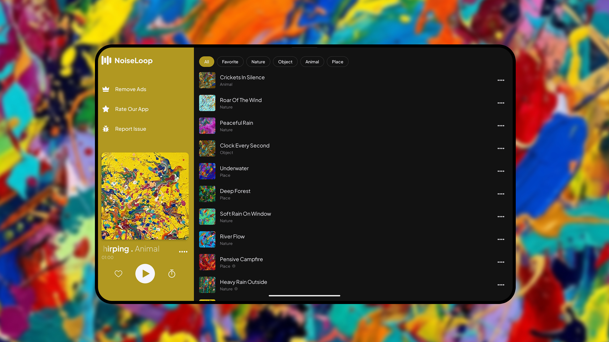
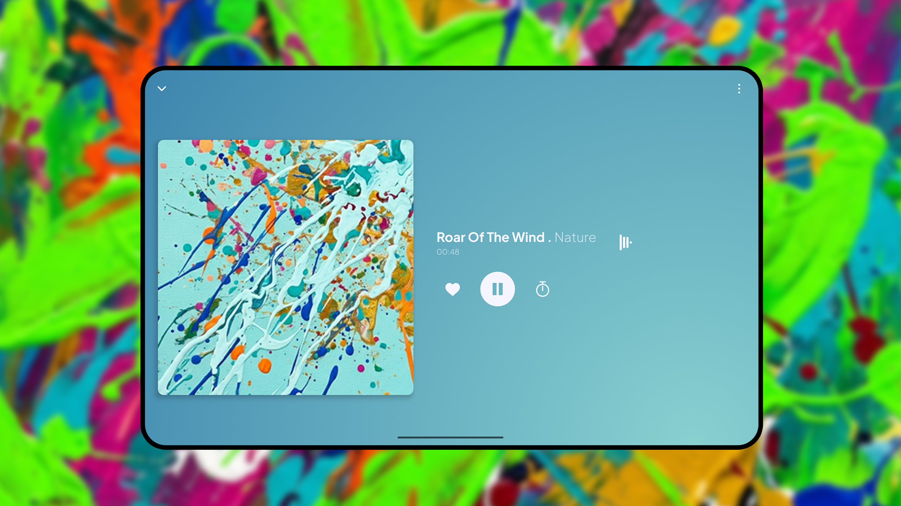

# NoiseLoop - Ambient Sound Player

  

NoiseLoop is an Android application designed to provide high-quality ambient sounds to help you focus, relax, or sleep. The app offers a variety of soundscapes that play continuously without interruption, designed for simplicity and battery efficiency.

  
  

## Features

### Infinite Playback
The app is built to play sounds indefinitely. Unlike standard players, NoiseLoop ensures the audio continues until you decide to stop it, making it ideal for overnight use.

### Sound Categories
Browse through different categories to find the right sound for your environment:
- **Nature**: Rain, wind, and ocean waves.
- **Objects**: Fans, white noise, and clocks.
- **Animals**: Crickets and birds.
- **Places**: Café atmosphere and train rides.

  

### Offline and Efficient
All sounds are stored locally, so the app works perfectly without an internet connection. It is also optimized to consume minimal battery, ensuring it can run for long periods without draining your device.

  
  

## Technical Limitations

### Audio Transitions
Because of how audio files are encoded, you might occasionally hear a small gap when a sound repeats. To fix this, we recommend manually editing the audio files to create a seamless loop.

### System Media Controls
NoiseLoop uses the Android Media3 library. Because of this, the appearance of the notification and lock screen controls follows the standard Android design and cannot be fully customized (such as hiding the previous/next buttons).

